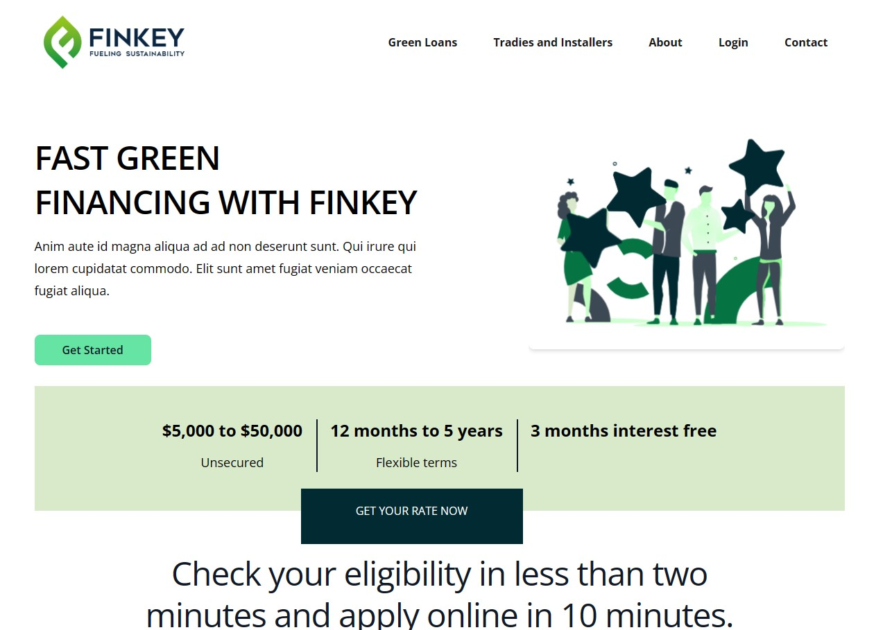
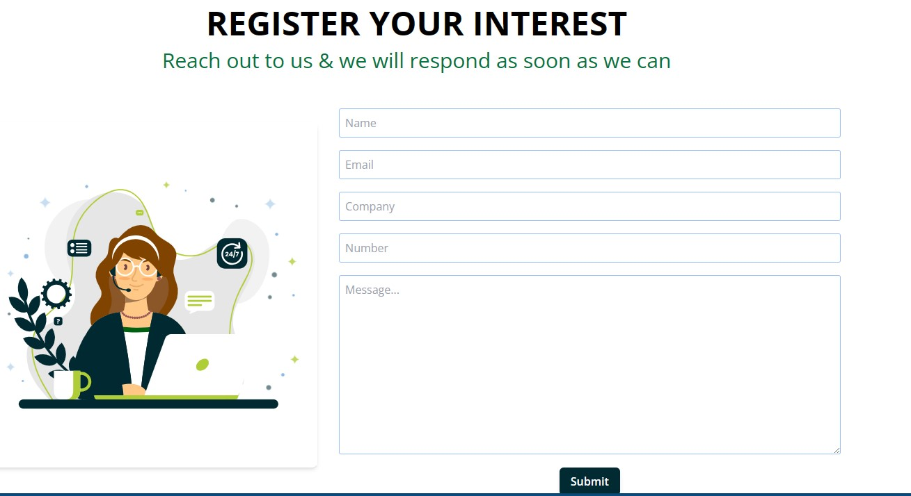

# Finkey Project

## Technologies Used

- [Vite](https://vitejs.dev/): A fast build tool for JavaScript and TypeScript projects.
- [React](https://reactjs.org/): A popular JavaScript library for building user interfaces.
- [React Router](https://reactrouter.com/): A routing library for React applications.
- [LocalForage](https://localforage.github.io/localForage/): A library that provides a simple API for storing data offline.
- [Lottie](https://airbnb.io/lottie/): A library for rendering animations and vector graphics.
- [Email.js](https://www.emailjs.com/): A service for sending emails directly from JavaScript code.
- [React Toastify](https://fkhadra.github.io/react-toastify/introduction): A library for creating toast notifications in React.
- [Match Sorter](https://github.com/kentcdodds/match-sorter): A simple, expected, and deterministic best-match sorting of an array in JavaScript.
- [React Icons](https://react-icons.github.io/react-icons/): A collection of popular icons for React applications.
- [React Multi Carousel](https://www.npmjs.com/package/react-multi-carousel): A responsive carousel component for React.
- [React Slick](https://react-slick.neostack.com/): A carousel/slider component for React applications.
- [Slick Carousel](https://kenwheeler.github.io/slick/): A responsive carousel library for the web.
- [Sort By](https://github.com/padolsey/sort-by): A utility for sorting arrays and objects by one or more properties.

## Demo

You can check out the live demo [here](https://redux-intro-nine.vercel.app/)

## Screenshots





## Run Locally

Clone the project

```bash
  git clone https://link-to-project
```

Go to the project directory

```bash
  cd my-project
```

Install dependencies

```bash
  npm install
```

Start the server

```bash
  npm start
```

## License

[MIT](https://choosealicense.com/licenses/mit/)
